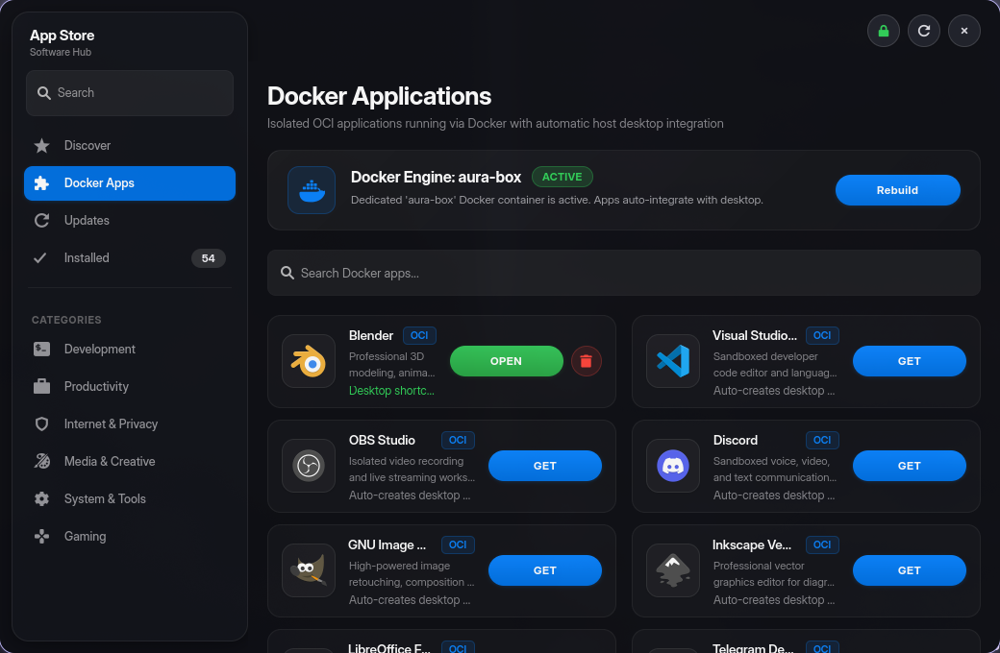
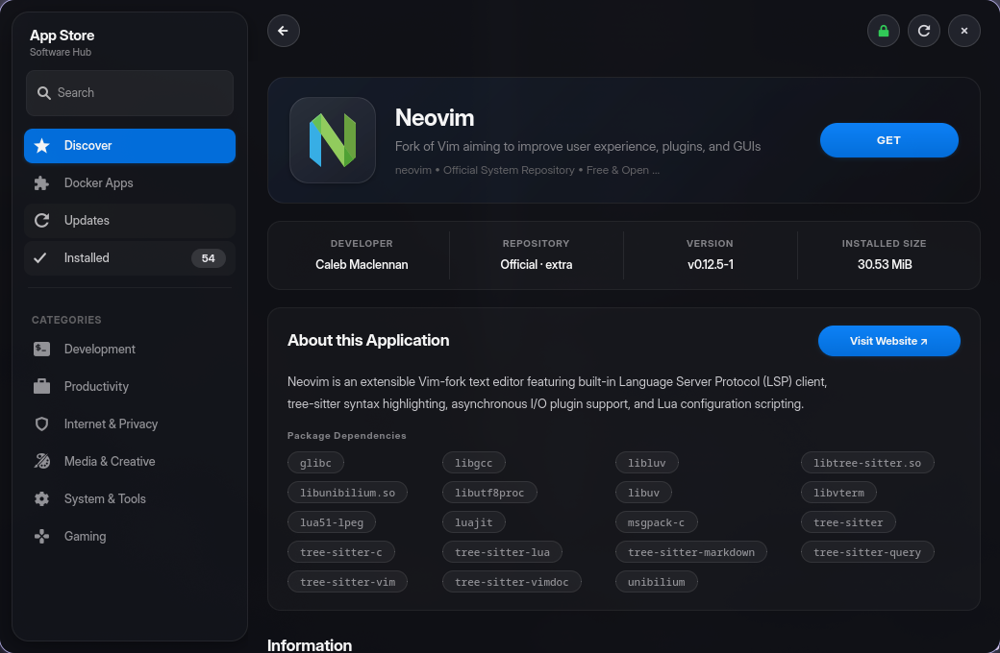
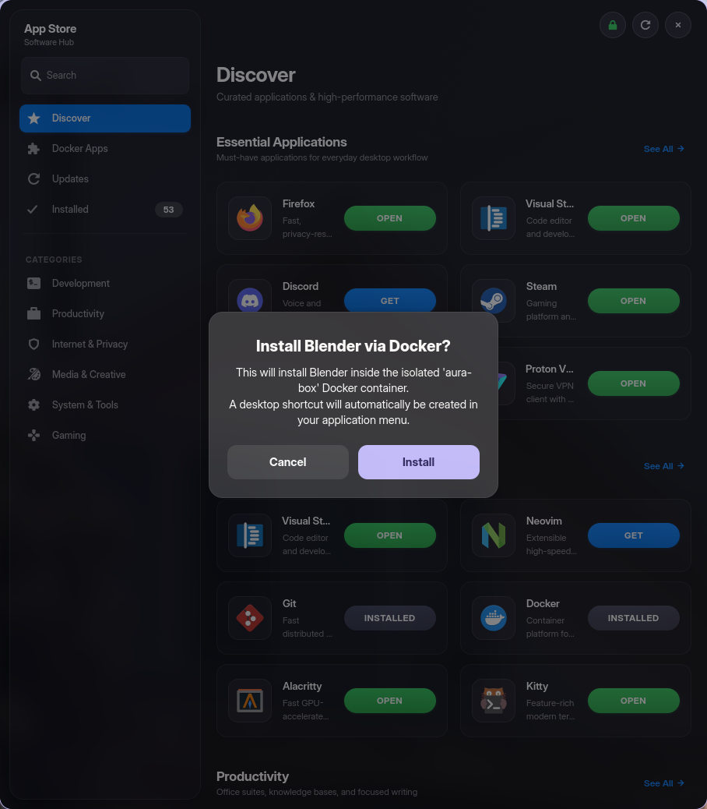
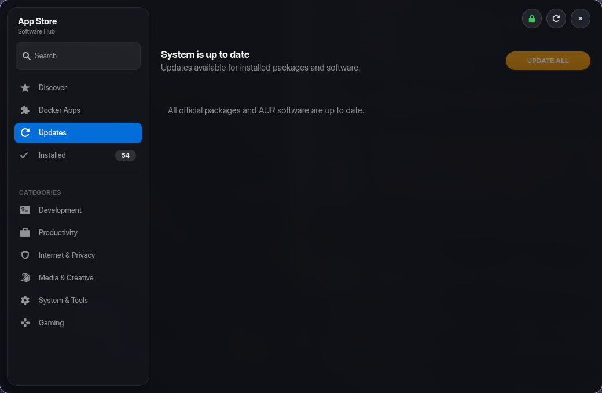
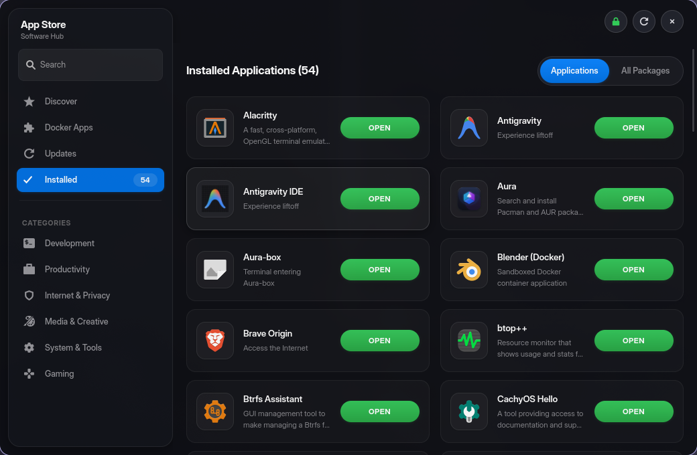
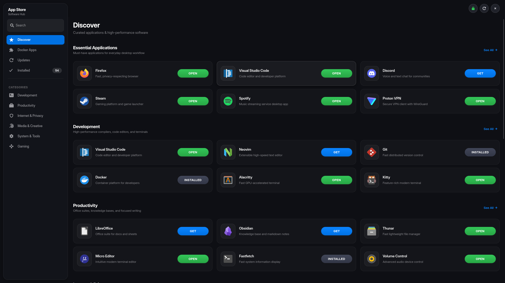

<div align="center">

# 🌌 Aura Package Hub
### The Modern, Mac-Inspired Software Center for Arch Linux & AUR

[](https://archlinux.org)
[](https://gnome.pages.gitlab.gnome.org/libadwaita/)
[](https://www.python.org/)
[](https://www.docker.com/)
[](LICENSE)

*An ultra-fast, visually stunning software hub designed for Arch Linux, CachyOS, and EndeavourOS. Features dual-tier Pacman + AUR searching, isolated native Docker application sandboxing, fluid iOS-style spring micro-interactions, and lifetime passwordless authorization.*

---

</div>

## 📸 Screenshots

<div align="center">

### 🌟 Discover Hub
Curated essential software, development suites, privacy tools, and media applications arranged in dynamic multi-column responsive grids.



---

### 🐳 Docker OCI Applications
Run desktop software in sandboxed containers with zero host package pollution. Automatically generates desktop menu shortcuts.


---

### 🔍 Full Package Inspector
Detailed software specifications, build dependencies, download sizes, licenses, upstream websites, and one-click actions.



---

### 🛡️ Smart Confirmation Sheets
In-window modal sheets with clear explanations, protecting your system before any container installation or package removal.



---

### ⚡ Batch Updates Manager & Installed Library
Instant status of all pending system upgrades with single-click batch updates and local desktop application management.

| Updates Page | Installed Applications |
| :---: | :---: |
|  |  |

---

### 🖥️ Fullscreen 3-Column Experience
Seamlessly adapts from narrow half-screen tiling layouts to wide 1080p/4K triple-column layouts via dynamic Libadwaita breakpoints.



</div>

---

## ✨ Features

- **⚡ Sub-Millisecond Dual-Tier Fuzzy Search**:
  - Instantaneous Pacman repository lookups prioritized before querying AUR via `paru` / `yay`.
  - Non-blocking asynchronous query debouncing for smooth typing at 60 FPS.

- **🎨 Apple Mac App Store Design System**:
  - Precision glassmorphism, subtle depth lighting, and monochromatic sidebar icons.
  - Fluid iOS/macOS spring curves (`cubic-bezier(0.2, 0.8, 0.2, 1)`) with interactive active press scale effects.
  - Zero UI blur or layout distortion when resizing or tiling.

- **🐳 Isolated Docker OCI Sandbox**:
  - 100% native Docker execution with zero third-party wrapper dependencies.
  - Automatically provisions an `aura-box` container with full Wayland and X11 display pass-through.
  - Pre-configured hardware acceleration (`mesa-gl`, `mesa-dri-gallium`, `mesa-egl`, `libx11`) so applications like Blender, OBS, and VS Code render with full GPU acceleration.
  - Automatically creates standard FreeDesktop `.desktop` shortcuts in `~/.local/share/applications/` with dynamic session display resolution.

- **🔐 Lifetime Passwordless Mode**:
  - Configure once, never get prompted for sudo password during package installations again.
  - Encrypted local vault stored in `~/.aura_vault` (permissions `0600`) backed by a dedicated sudoers askpass integration (`/etc/sudoers.d/aura-pacman`).

- **🪟 Hyprland & Tiling Window Manager Optimized**:
  - Clean floating header without redundant title bars or minimize/maximize buttons that conflict with tiling window managers.
  - Robust minimum-width enforcement (minimum 398px content width), eliminating window overflow warnings when snapped side-by-side on 1080p displays.

- **📦 Rich Technical Specifications**:
  - View package architecture, download size, installed size, build packager, license, and interactive dependency chips that open their respective packages on click.

---

## 🚀 Quick Start

### One-Command Instant Installation

Run this single command in your terminal to automatically download, configure dependencies, and install Aura:

```bash
curl -fsSL https://raw.githubusercontent.com/Desplicableme/aura/main/install.sh | bash
```

Or clone manually:

```bash
git clone https://github.com/Desplicableme/aura.git
cd aura
./install.sh
```

---

### Arch User Repository (AUR)

If you are using an AUR helper such as `paru` or `yay`:

```bash
paru -S aura-appstore-git
# or
yay -S aura-appstore-git
```

Or build manually via `makepkg`:

```bash
git clone https://github.com/Desplicableme/aura.git
cd aura
makepkg -si
```

---

## 🛠️ System Requirements

| Component | Required Package | Notes |
| :--- | :--- | :--- |
| **Operating System** | Arch Linux / CachyOS / EndeavourOS / Manjaro | Any `pacman`-based Linux distribution |
| **Python** | `python >= 3.10` | Core programming language |
| **GTK & Libadwaita** | `gtk4`, `libadwaita`, `python-gobject` | Modern graphical toolkit & design patterns |
| **Package Utilities** | `pacman-contrib` | Provides `checkupdates` for update checks |
| **AUR Helper** | `paru` (preferred) or `yay` | Required for AUR search and builds |
| **Container Engine** | `docker` *(optional)* | Required only for the Docker Applications sandbox |

---

## ⌨️ Command Line Usage

Aura supports deep command-line routing:

```bash
# Launch default Discover view
aura

# Launch directly with a search query
aura "visual studio code"

# Open directly to Updates page
aura --updates
aura -u

# Open directly to Installed Applications
aura --installed

# Open directly to Docker Applications Sandbox
aura --docker
aura -D

# View details for a specific package
aura --detail neovim
aura -d blender

# Explore a specific category (e.g. dev, games, productivity, media, security)
aura --category dev

# Open in fullscreen mode
aura --fullscreen
```

---

## 📂 Project Structure

```
aura/
├── aura.py                     # Main application entry point & CLI parser
├── aura_backend.py             # Pacman, Paru & Docker container managers
├── aura_ui.py                  # GTK4/Libadwaita interface & macOS CSS system
├── aura-askpass                # Sudo askpass integration script
├── install.sh                  # Interactive system installer
├── uninstall.sh                # Clean uninstaller script
├── PKGBUILD                    # Arch Linux package specification
├── LICENSE                     # GNU General Public License v3
├── README.md                   # Project documentation
├── data/
│   ├── io.github.aura.desktop  # Desktop launcher entry
│   ├── io.github.aura.metainfo.xml # AppStream metadata
│   ├── hyprland-aura.conf      # Hyprland window rules config
│   └── icons/
│       ├── io.github.aura.svg  # Application icon
│       └── docker-symbolic.svg # Custom Docker symbolic icon
└── screenshots/                # Visual documentation assets
```

---

## 🪟 Hyprland Configuration

To ensure Aura floats nicely and avoids background layer blur conflicts, add the following to your `~/.config/hypr/hyprland.conf`:

```ini
# Aura Package Hub Window Rules
windowrulev2 = float, class:^(io.github.aura)$
windowrulev2 = center, class:^(io.github.aura)$
windowrulev2 = size 1040 680, class:^(io.github.aura)$
windowrulev2 = opaque, class:^(io.github.aura)$
```

Or simply source the included configuration file:

```ini
source = ~/.local/share/aura/data/hyprland-aura.conf
```

---

## 🤝 Contributing

Contributions are welcome! Whether it's adding new curated application categories, improving translations, or enhancing UI animations:

1. Fork the Project
2. Create your Feature Branch (`git checkout -b feature/AmazingFeature`)
3. Commit your Changes (`git commit -m 'Add some AmazingFeature'`)
4. Push to the Branch (`git push origin feature/AmazingFeature`)
5. Open a Pull Request

---

## 📄 License

Distributed under the **GNU General Public License v3 (GPL-3.0-or-later)**. See [`LICENSE`](LICENSE) for more details.
